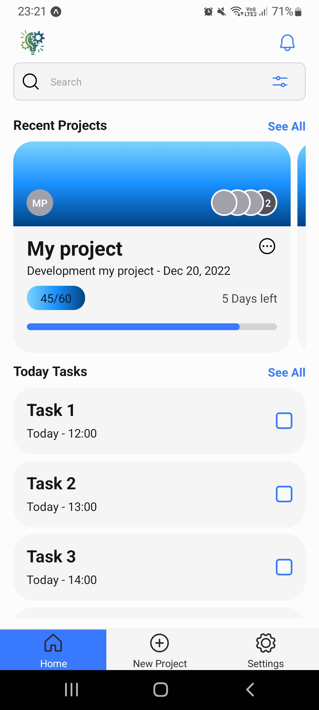
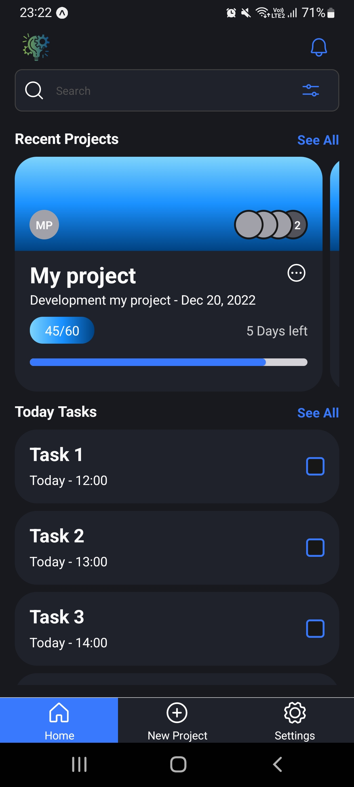

# Next Step App

Application for project and task management build with [React Native](https://reactnative.dev/) and [Expo](https://expo.io/) managed workflow.

### Main libraries used

- [Native Base](https://nativebase.io/)
- [Phosphor Icons](https://phosphoricons.com/)
- [React Navigation](https://reactnavigation.org/)

### Light and Dark theme

  
  

